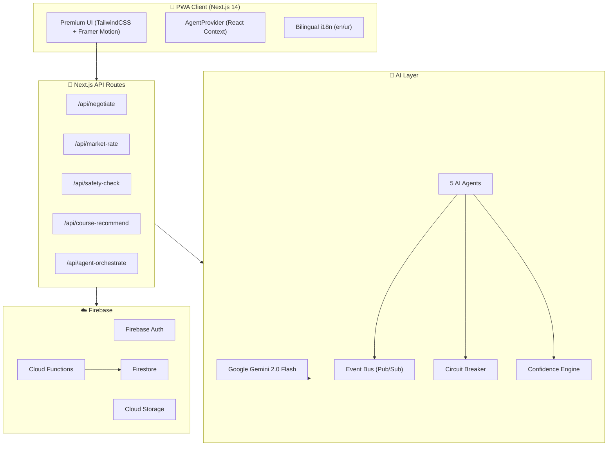

<p align="center">
  
</p>

<h1 align="center">RozgarSync — روزگار سنک</h1>

<p align="center">
  <strong>AI-Powered Service Orchestrator for Pakistan's Informal Gig Economy</strong>
</p>

<p align="center">
  
  
  
  
  
  
</p>

<p align="center">
  Built with ❤️ for <strong>AI Seekho 2026</strong> | Google × InnoVista × Telenor × Ministry of IT
</p>

---

## 📋 Table of Contents

- [Problem Statement](#-problem-statement)
- [Solution Overview](#-solution-overview)
- [AI Agent Architecture](#-ai-agent-architecture)
- [Tech Stack](#-tech-stack)
- [Key Features](#-key-features)
- [System Architecture](#-system-architecture)
- [Agent Deep Dive](#-agent-deep-dive)
- [API Documentation](#-api-documentation)
- [Setup & Installation](#-setup--installation)
- [Project Structure](#-project-structure)
- [Design Decisions](#-design-decisions)
- [Team](#-team)

---

## 🎯 Problem Statement

Pakistan has over **30 million informal gig workers** — plumbers, electricians, painters, drivers, tailors, and more. They face:

| Problem | Impact |
|---------|--------|
| **Wage exploitation** | Workers paid 30-50% below market rate |
| **No social security** | Zero EOBI contributions for retirement |
| **Safety risks** | No verification, no emergency protocols |
| **No skill development** | No visibility into in-demand skills |
| **Language barrier** | Most platforms are English-only |

**RozgarSync** solves all of these through a multi-agent AI system that autonomously protects, matches, and upskills Pakistan's gig workers.

---

## 💡 Solution Overview

RozgarSync is a **multi-agent AI orchestration platform** that deploys 5 specialized AI agents to manage the entire gig economy lifecycle:

```
┌──────────────────────────────────────────────────────┐
│                  🧠 RozgarSync AI                     │
│                                                       │
│  ┌─────────┐ ┌─────────┐ ┌─────────┐ ┌─────────┐    │
│  │Opportun-│ │FairWage │ │ Safety  │ │Financial│    │
│  │  ity    │ │Negotia- │ │Guardian │ │Protector│    │
│  │Matcher  │ │  tor    │ │         │ │         │    │
│  └────┬────┘ └────┬────┘ └────┬────┘ └────┬────┘    │
│       │           │           │           │          │
│  ┌────┴───────────┴───────────┴───────────┴────┐     │
│  │          Shared Event Bus (Pub/Sub)          │     │
│  └─────────────────────┬───────────────────────┘     │
│                        │                              │
│                 ┌──────┴──────┐                       │
│                 │  Upskilling │                       │
│                 │   Coach     │                       │
│                 └─────────────┘                       │
└──────────────────────────────────────────────────────┘
```

Each agent follows a **6-phase lifecycle**: `Perceive → Deliberate → ToolUse → Decide → Act → Observe`

---

## 🤖 AI Agent Architecture

### Core Framework

Built on a **Template Method** pattern with production-grade resilience:

| Component | Purpose |
|-----------|---------|
| **BaseAgent** | Abstract 6-phase lifecycle with retry logic |
| **EventBus** | In-memory pub/sub with wildcard subscriptions, dead-letter queue |
| **CircuitBreaker** | 3-state (closed/open/half-open) protection for API calls |
| **ConfidenceEngine** | Multi-factor weighted confidence scoring |
| **AuditLogger** | SHA-256 hash chain for tamper-evident decision trails |

### Gemini AI Integration

All agents are powered by **Google Gemini 2.0 Flash** for:
- Bilingual reasoning generation (English + Urdu)
- Structured JSON responses for reliable parsing
- Context-aware wage negotiation and risk assessment
- Personalized skill gap analysis and course recommendations

### Agent Decision Trace

Every AI decision produces an immutable trace:

```json
{
  "id": "log_abc123",
  "agentName": "FairWageNegotiator",
  "decisionType": "price_suggestion",
  "confidence": 0.88,
  "latencyMs": 320,
  "reasoning": {
    "en": "Proposed budget (PKR 1500) is 15% below market median...",
    "ur": "تجویز کردہ بجٹ (PKR 1500) مارکیٹ کی اوسط سے 15% کم ہے..."
  },
  "traceChainHash": "sha256_abc...",
  "modelId": "gemini-2.0-flash"
}
```

---

## 🏗️ Tech Stack

| Layer | Technology | Purpose |
|-------|-----------|---------|
| **AI** | Google Gemini 2.0 Flash | Agent reasoning, bilingual text generation |
| **Frontend** | Next.js 14 (App Router) | SSR, routing, API routes |
| **Styling** | TailwindCSS 3.4 + Framer Motion | Premium UI with animations |
| **Backend** | Firebase Cloud Functions | Escrow management, audit logging |
| **Database** | Firebase Firestore | Real-time data, security rules |
| **Auth** | Firebase Authentication | Google Sign-In, email/password |
| **i18n** | next-intl | English + Urdu bilingual support |
| **Charts** | Recharts | Analytics visualization |
| **Maps** | @react-google-maps/api | Location-based matching |
| **PWA** | next-pwa | Offline-first mobile experience |
| **Types** | TypeScript 5.6 | End-to-end type safety |

---

## ✨ Key Features

### 🎯 Smart Gig Matching (OpportunityMatcher Agent)
- Multi-dimensional scoring: skill match (30%), proximity (25%), availability (15%), rating (15%), fairness (15%)
- Haversine distance calculation for proximity
- Anti-starvation algorithm to redistribute opportunities fairly

### 💰 Fair Wage Protection (FairWageNegotiator Agent)
- Real-time comparison against Pakistan market rates across 15 categories × 12 cities
- CPI inflation adjustment (currently 1.29 factor)
- Automatic counter-offer generation for below-market wages
- Exploitative wage blocking (below PKR 32,000/month minimum wage)
- Seasonal factor adjustment (Eid, monsoon, wedding season)

### 🛡️ Safety Guardian
- AI-powered risk scoring based on location, time, category, employer verification
- SOS Protocol with Pakistan emergency contacts (Police 15, Rescue 1122, Edhi 115)
- Real-time threat classification (Critical/High/Medium/Low)
- Gig and escrow freeze on SOS activation

### 🏦 Financial Protection
- Smart escrow with 90/5/5 split (Worker/Platform/EOBI)
- SHA-256 integrity hashing for tamper-evident transactions
- Idempotency keys for safe retries
- Automatic EOBI contribution tracking for social security
- Micro-insurance integration (Sehat Sahulat-style)

### 📚 AI Upskilling Coach
- Skill gap analysis from rejection patterns
- Personalized course recommendations (NAVTTC, PSDF, Coursera)
- Income boost projections
- Career progression pathway generation

### 🌐 Bilingual Support
- Full English + Urdu UI with RTL support
- AI-generated bilingual reasoning in all agent decisions
- Noto Nastaliq Urdu typography for authentic rendering

---

## 🏛️ System Architecture



---

## 🔍 Agent Deep Dive

### 1. OpportunityMatcher (1,656 LOC)
```
Perceive → Extract gig requirements, worker location
Deliberate → Score candidates on 5 weighted dimensions
ToolUse → Query worker history, calculate distances
Decide → Rank top candidates with confidence score
Act → Emit gig.matched events, notify workers
Observe → Track acceptance rates, update fairness weights
```

### 2. FairWageNegotiator (2,473 LOC)
```
Perceive → Load market rates, city cost-of-living, seasonal factors
Deliberate → Classify wage: fair / below_market / exploitative
ToolUse → Calculate adjusted rates, assess fairness (0-100)
Decide → Approve, counter-offer, or block
Act → Emit wage.assessed / wage.counter_offer events
Observe → Track negotiation outcomes, update moving averages
```

### 3. SafetyGuardian (983 LOC)
```
Perceive → Analyze location, time, employer verification status
Deliberate → Risk scoring using category risk tables
ToolUse → Check employer history, verify CNIC via simulated NADRA
Decide → Classify: Critical / High / Medium / Low
Act → Activate SOS protocol if needed, notify authorities
Observe → Track incident reports, update risk models
```

### 4. FinancialProtector (1,021 LOC)
```
Perceive → Validate escrow amount, worker/employer details
Deliberate → Check fraud patterns, withdrawal limits
ToolUse → Compute splits (90/5/5), generate integrity hashes
Decide → Approve or flag transaction
Act → Execute Firestore batch writes with EOBI tracking
Observe → Monitor dispute rates, update thresholds
```

### 5. UpskillingCoach (521 LOC)
```
Perceive → Analyze rejection patterns, skill gaps
Deliberate → Identify in-demand skills vs worker skills
ToolUse → Match courses from NAVTTC/PSDF/online catalogs
Decide → Generate personalized learning path
Act → Send course recommendations with income boost estimates
Observe → Track course completion, skill improvement
```

---

## 📡 API Documentation

### POST `/api/agent-orchestrate`
Master endpoint that runs all 5 agents on a scenario.

**Request:**
```json
{
  "scenario": {
    "title": "AC Repair in Gulberg",
    "category": "ac_repair",
    "city": "Lahore",
    "budget": { "min": 1500, "max": 2500 },
    "urgency": "high",
    "description": "Split AC unit not cooling, need urgent repair"
  }
}
```

**Response:**
```json
{
  "traces": [
    {
      "agentName": "OpportunityMatcher",
      "confidence": 0.85,
      "latencyMs": 1200,
      "reasoning": { "en": "...", "ur": "..." },
      "decision": { "topCandidates": [...] }
    }
  ],
  "summary": { "en": "...", "ur": "..." },
  "totalLatencyMs": 4500
}
```

### POST `/api/negotiate`
AI-powered wage fairness analysis.

### GET `/api/market-rate?category=plumber&city=Lahore`
Market rate data with AI-generated insights.

### POST `/api/safety-check`
AI risk assessment for gig scenarios.

### POST `/api/course-recommend`
Personalized AI learning path recommendations.

---

## 🚀 Setup & Installation

### Prerequisites
- Node.js 18+
- Firebase project with Firestore enabled
- Google Gemini API key

### Quick Start

```bash
# Clone repository
git clone https://github.com/your-repo/rozgarsync.git
cd rozgarsync

# Install dependencies
npm install

# Configure environment
cp .env.local.example .env.local
# Edit .env.local with your API keys

# Run development server
npm run dev
```

### Environment Variables

| Variable | Required | Description |
|----------|----------|-------------|
| `GOOGLE_GEMINI_API_KEY` | ✅ | Google Gemini API key |
| `NEXT_PUBLIC_FIREBASE_*` | ✅ | Firebase configuration |
| `NEXT_PUBLIC_GOOGLE_MAPS_API_KEY` | Optional | Google Maps API key |

---

## 📁 Project Structure

```
src/
├── app/
│   ├── api/                    # AI-powered API routes
│   │   ├── agent-orchestrate/  # Master orchestration endpoint
│   │   ├── negotiate/          # Wage negotiation AI
│   │   ├── market-rate/        # Market rate analysis
│   │   ├── safety-check/       # Safety risk assessment
│   │   └── course-recommend/   # Skill recommendations
│   └── [locale]/               # i18n pages (en/ur)
│       ├── dashboard/          # AI Command Center
│       ├── demo/               # Judge Demo Mode
│       ├── onboarding/         # User registration wizard
│       ├── wallet/             # Financial dashboard
│       ├── safety/             # Safety center
│       └── skills/             # Upskilling hub
├── components/
│   ├── ui/                     # Reusable UI components
│   ├── layout/                 # Header, Footer, Sidebar
│   └── dashboard/              # Dashboard-specific components
├── lib/
│   ├── ai/                     # Gemini AI client
│   ├── agents/                 # 5 AI agents + core framework
│   │   ├── core/               # BaseAgent, EventBus, CircuitBreaker
│   │   ├── opportunity-matcher/
│   │   ├── fair-wage-negotiator/
│   │   ├── safety-guardian/
│   │   ├── financial-protector/
│   │   └── upskilling-coach/
│   ├── firebase/               # Firebase Auth + Firestore
│   └── providers/              # React Context providers
├── messages/                   # i18n translations (en.json, ur.json)
└── types/                      # TypeScript definitions (711 lines)
```

---

## 🎨 Design Decisions

1. **Multi-Agent Architecture** — Instead of a single monolithic AI, we deploy 5 specialized agents that communicate via an event bus. This enables parallel processing, independent scaling, and clear separation of concerns.

2. **Bilingual-First** — Every AI response includes both English and Urdu text. The UI supports RTL rendering with Noto Nastaliq Urdu for authentic typography.

3. **Circuit Breaker Pattern** — All Gemini API calls are wrapped in a circuit breaker to prevent cascading failures. If the AI is unavailable, agents fall back to rule-based logic.

4. **Immutable Audit Trail** — Every agent decision produces a SHA-256 hash chain. Cloud Functions enforce immutability — no client can modify existing audit logs.

5. **EOBI Auto-Deduction** — A unique feature that auto-deducts 5% for EOBI (Employees' Old-Age Benefits Institution) contributions, giving gig workers access to social security.

6. **PWA-First** — Built as a Progressive Web App for offline-first experience, critical for workers in areas with intermittent connectivity.

---

## 👥 Team

| Name | Role |
|------|------|
| Ahmed Ali Ghori | Team Lead |

---

## 📄 License

Built for **AI Seekho 2026** hackathon. © 2026 RozgarSync Team.
