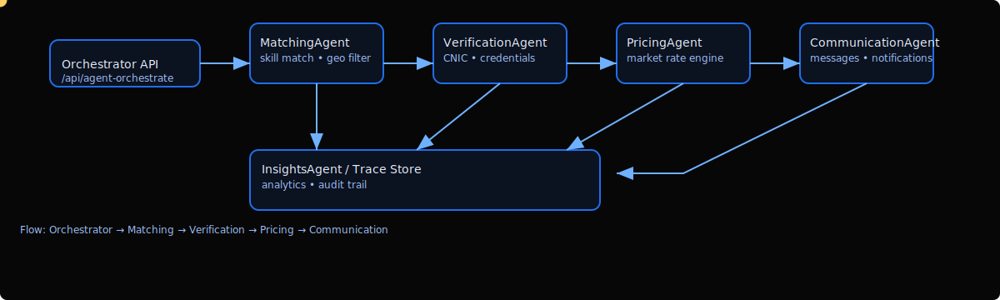

# RozgarSync — Animated Architecture & Workflow



This document complements the main `README.md` with an animated visual and a focused architecture walkthrough describing how a user request flows through the multi-agent system.

## Quick Summary

- The animated workflow above demonstrates the primary orchestration path:
  - `Orchestrator API` → `MatchingAgent` → `VerificationAgent` → `PricingAgent` → `CommunicationAgent` → `InsightsAgent` (trace store)
- The pipeline is event driven; tasks are published to an Event Bus and agents consume events and emit new events.

## Where to find code

- Event Bus: `src/lib/agents/core/event-bus.ts`
- Agents directory: `src/lib/agents/` (each agent has a small worker module and an interface to the bus)
- Orchestration API: `src/app/api/agent-orchestrate/route.ts`
- AI helpers: `src/lib/ai/gemini.ts`
- Trace Viewer: `src/components/ui/AgentTraceViewer.tsx`

## Agents — responsibilities

- **MatchingAgent**: Rank and filter candidate workers. Uses skills, distance, ratings, and availability.
- **VerificationAgent**: Validate identity and credentials; writes verification state to Firestore.
- **PricingAgent**: Compute dynamic recommended price using internal market data and optional external price API.
- **CommunicationAgent**: Formats bilingual messages (Urdu/English) and dispatches notifications.
- **InsightsAgent**: Aggregates traces, computes metrics, and stores telemetry for dashboards.

## Example request lifecycle

1. Client calls `POST /api/agent-orchestrate` with task payload (user, location, job type).
2. Server wraps payload in a Task envelope and publishes `TASK_RECEIVED` to the Event Bus.
3. `MatchingAgent` picks top N candidates and emits `SKILL_MATCH` events for each selected candidate.
4. `VerificationAgent` verifies identity and emits `ID_VERIFIED` or `ID_FAILED`.
5. `PricingAgent` sets `PRICE_SET` event with recommended price.
6. `CommunicationAgent` prepares and sends confirmations; `InsightsAgent` records full trace.

## Run locally

```bash
cd "d:/Hackton Project"
npm install
npm run dev
# Open http://localhost:3000
```

## Want changes?

I can:
- Convert the SVG to an animated GIF or Lottie file for better cross‑platform rendering.
- Embed a small interactive Mermaid diagram instead of an SVG.
- Update the main `README.md` to include this animated content inline.

If you'd like me to commit and push these files to GitHub, say "commit and push" and I'll create a commit and push it to your remote.
